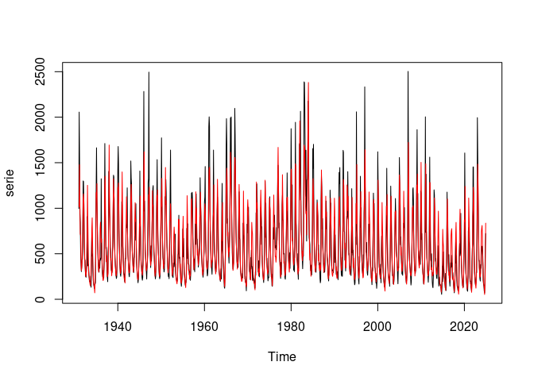
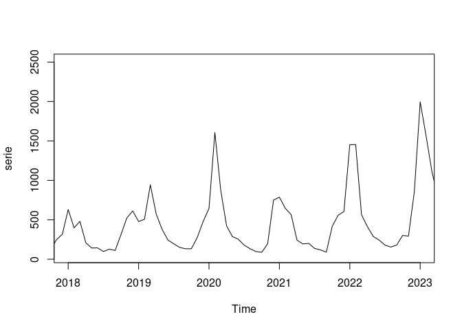

<!-- README.md is generated from README.Rmd. Please edit that file -->

# parmodels

<!-- badges: start -->

[](https://github.com/lkhenayfis/parmodels/actions/workflows/R-CMD-check.yaml)
[](https://app.codecov.io/gh/lkhenayfis/parmodels)
<!-- badges: end -->

Este pacote contem toda a funcionalidade necessaria para estimacao,
incluindo selecao de ordem automatica, e uso de modelos autorregressivos
periodicos (PAR). Funcoes para computo e visualizacao das
autocorrelacoes (comuns e parciais) periodicas (PACF) sao tambem
disponibilizadas. Modelos do tipo PAR-A, com componente anual, tambem
sao suportados, bem como as funcoes de autocorrelacao condicionais
envolvidas na sua estimacao.

## Instalacao

A versao de desenvolvimento do pacote pode ser instalada a partir de
[GitHub](https://github.com/):

``` r
# install.packages("remotes")
remotes::install_github("lkhenayfis/parmodels")
```

## Exemplo

A seguir esta um exemplo simples de estimacao de modelo e previsao para
um caso simples, utilizando dados internos do pacote:

``` r
library(parmodels)
#> 
#> Attaching package: 'parmodels'
#> The following object is masked from 'package:graphics':
#> 
#>     par

serie <- dummyseries[, 2]
modelo <- par(serie, max_p = 3)

plot(serie)
lines(fitted(modelo), col = "red")
```



``` r

preds <- predict(modelo, n.ahead = 12)
plot(serie, xlim = c(2018, 2023))
lines(preds, col = "blue")
```


